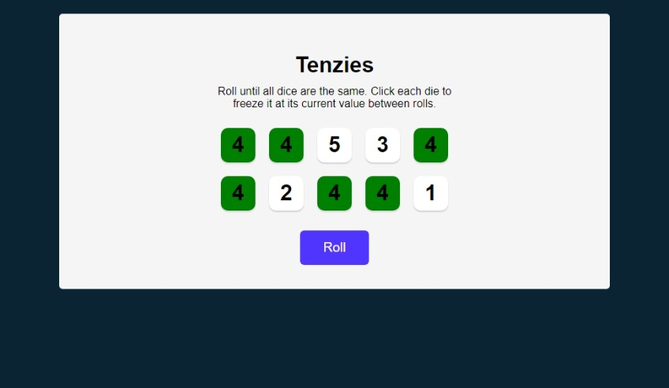

# Tenzies Game from Scrimba

This is a project from the [Learn React](https://scrimba.com/learn/learnreact) course from [Scrimba](https://scrimba.com/).

### The challenge

Users should be able to:

- View the optimal layout for the interface depending on their device's screen size
- See hover and focus states for all interactive elements on the page

### Screenshot

### Links

- [View Code](https://github.com/elizerdim/tenzies-game)
- [Live Preview](https://tenzies-game-liart.vercel.app/)

## My process

### Built with

- HTML
- CSS
- React

### What I learned

I completed this project on Scrimba back in September 2023 when I was first learning React and wanted to include it here for reference. I coded some parts differently while creating a repo from it, which was a great opportunity to practice React and JavaScript in general. used Math.random(), Set, conditional rendering, useState, and npm packages nanoid and react-confetti, which was particularly fun!